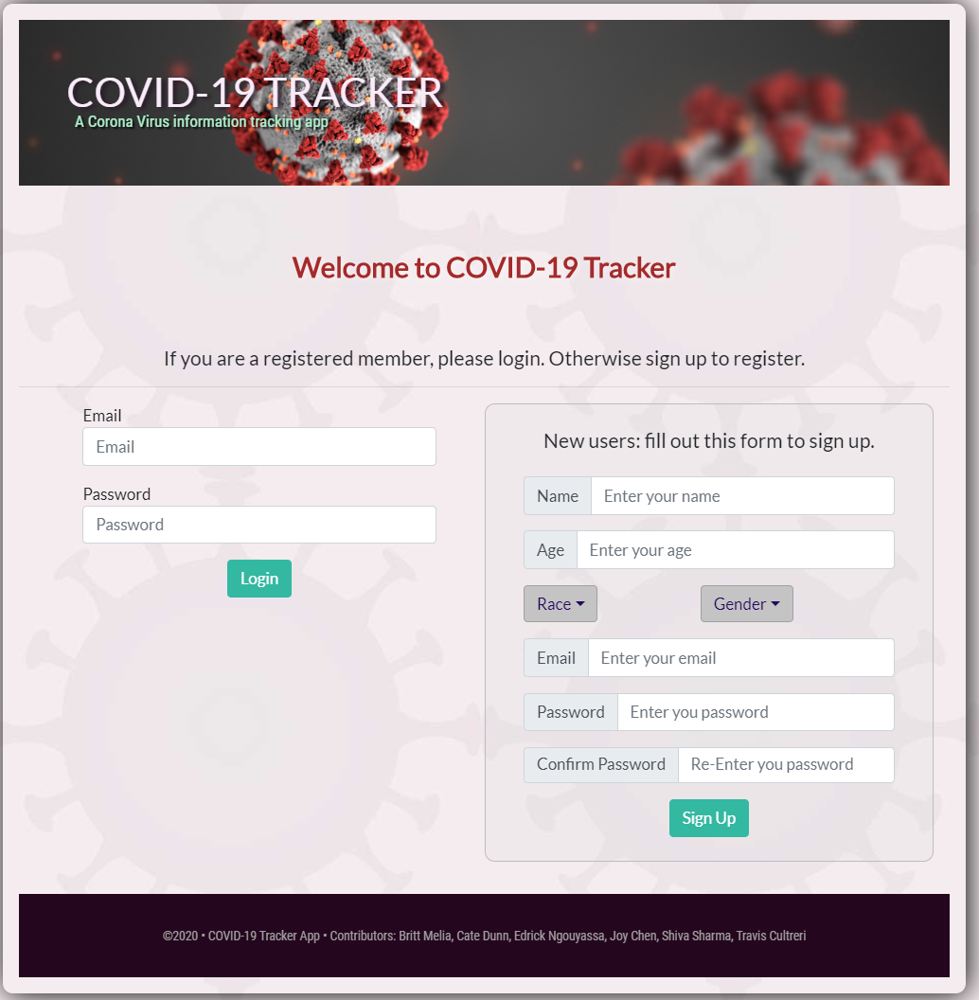
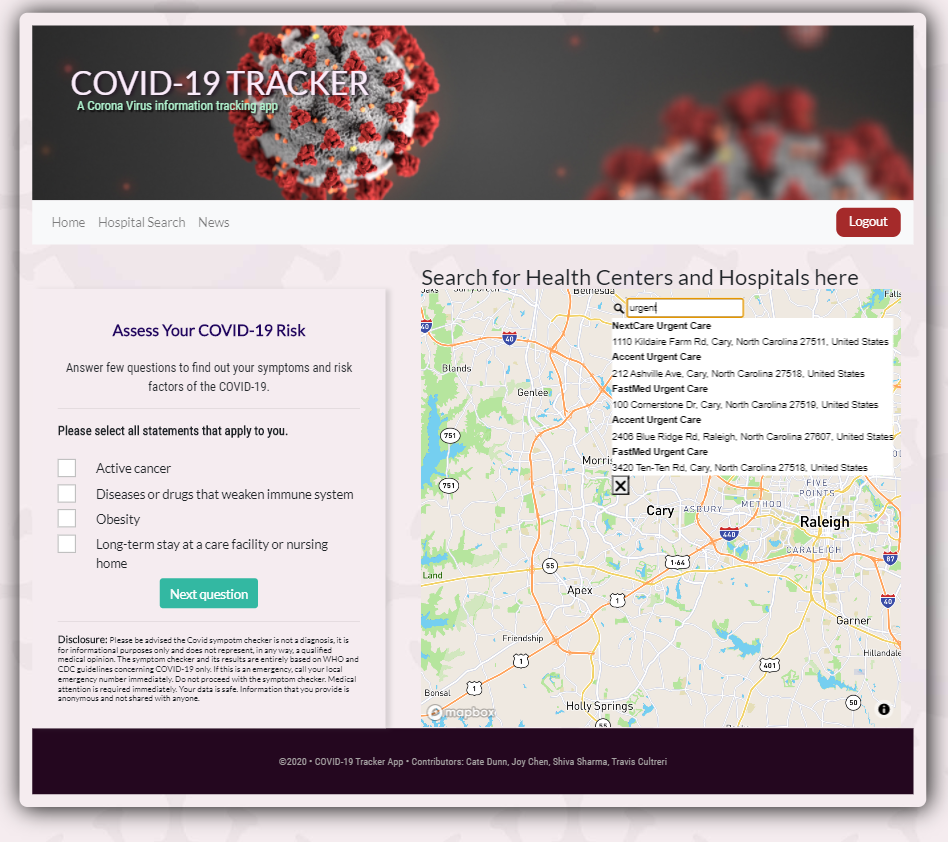
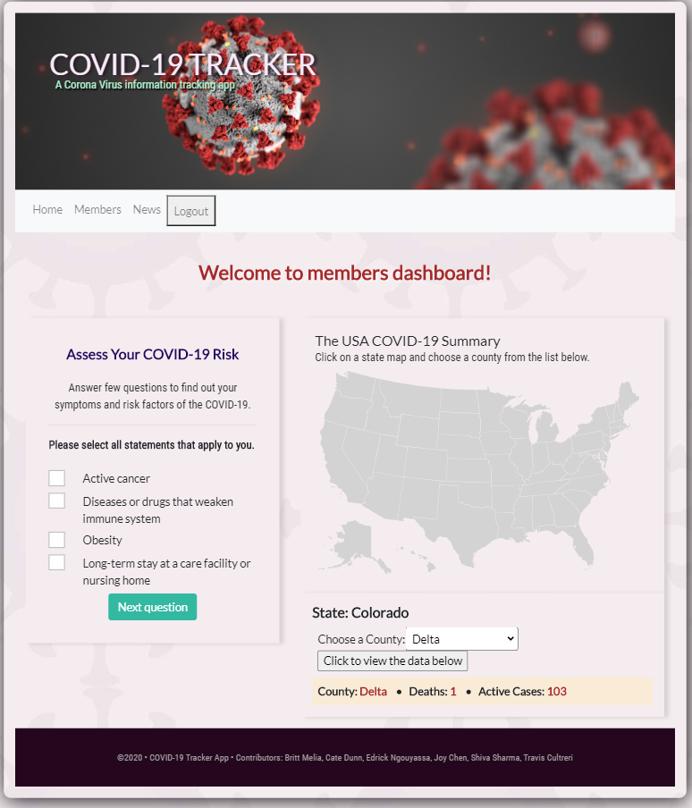

## COVID-19 Tracker
   
   

## Description
This application, powered by React.JS and JavaScript, will allow the user to create a profile and allow them to use a symptom checker and map to find out information. It will allow the user to fill out a questionnaire that will advise the user on triage levels and if further medical intervention is needed. The map allows the user to click on their state and county and see the current active cases and deaths. This application also provides up-to-date news articles on COVID-19.

If you believe you have been exposed to COVID or possible have COVID, you can check out our symptom checker and find a medical facility near you.

## Table of Contents
* [User Story](#userstory)
* [Demo](#demo)
* [License](#license)
* [Contributors](#contributors)
* [Questions](#questions)
* [Credits](#credits)

## User Story

As a person living within the United States, I want to check to see the current active cases in my state and county as well as check my current symptoms, so that I can ensure that I am acting appropriately and keep track of my state and county's progress in the pandemic.

## Demo
Visit https://covid19-symptom-tracker-app.herokuapp.com/ to see the live demo.

## License
 

## Contributors
Travis Cultreri: https://github.com/traviscult  
Cate Dunn: https://github.com/CateDunn  
Joy Chen: https://github.com/joychen5069  
Shiva Sharma: https://github.com/ssh1sharma  

## Questions
If you see any improvements that can be made, please email me at joychen5069@gmail.com or visit the gitHub page at https://github.com/joychen5069/COVID-App

### Credits:

- Covid-19 logo: cdc.gov
- API: corona.azure-api.net, Infermedica, NewsApi
- Map: react-usa-map
